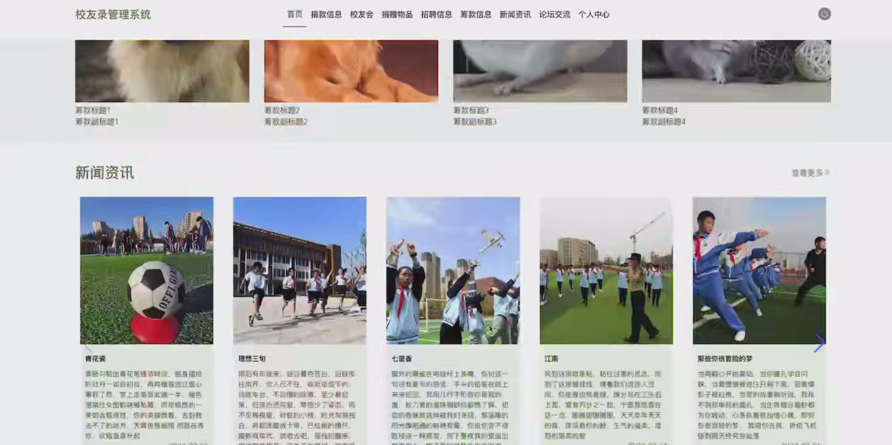

# 基于SpringBoot+Vue的校友录管理系统设计与实现

#### 介绍
基于SpringBoot+Vue的校友录管理系统设计与实现；附有完整源码➕数据库➕文档等。

本项目可以用于毕业设计，白嫖勿扰！
全网毕业设计项目这里都有

#### 课题背景
随着社会的进步与信息化的发展，校友关系的维系与管理成为各大高校重要的工作内容之一。校友资源不仅对学校的声誉、发展和社会影响力有着积极推动作用，还能为在校学生提供宝贵的职业发展、创业机会和社会网络。传统的校友管理方式大多依赖纸质档案或简单的数据库记录，信息更新滞后，沟通渠道不畅，缺乏高效的校友互动平台，这些问题使得校友资源的整合与利用受到极大限制。

为了解决这些问题，开发一个基于SpringBoot和Vue的校友录管理系统显得尤为重要。SpringBoot作为一款高效的Java后端框架，能够实现系统的高并发支持、数据安全和灵活扩展，适合处理校友管理中的各种信息交互、查询、更新等任务；Vue.js作为前端框架，提供了灵活的组件化开发和响应式设计，能够为用户提供良好的操作体验。通过这两者的结合，可以实现校友信息的集中管理、动态更新、以及校友之间的互动交流。

该系统将帮助学校建立一个完整的校友数据库，促进校友之间的交流与合作，提升学校的品牌效应。校友可以通过系统查看校友信息、发布动态、参与校友活动，学校也能通过系统与校友保持长期联系，开展各类校友活动和捐赠项目。最终，基于SpringBoot+Vue的校友录管理系统将为校友管理工作带来更多便捷与高效，同时提升学校对校友资源的利用率，推动校友网络的良性发展。

#### 获取源码
V：13283346760

Q：985089028

注意：添加时备注项目名称

#### 软件架构
开发环境：JDK8、SpringBoot、Maven、MySQL、Vue

#### 安装教程

1.  下载IDEA集成开发工具
2.  配置Maven环境
3.  启动项目

#### 项目运行截图

